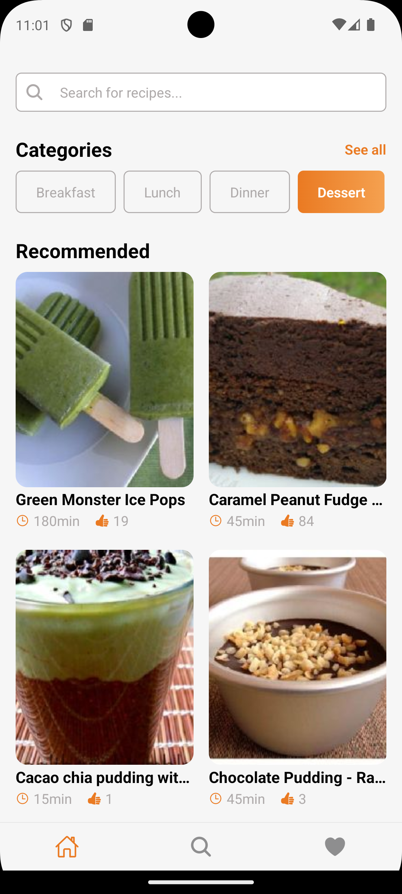
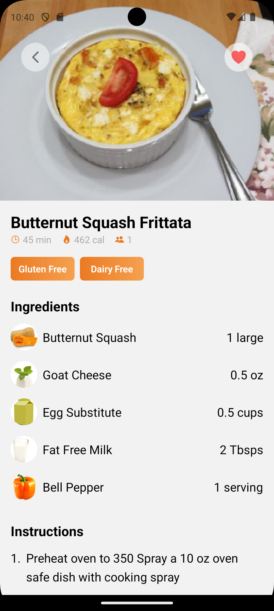

# Recipe Vault

## Description
Recipe Vault is a mobile application built with React Native and Expo that allows users to discover and explore recipes. The app features a modern design and a user-friendly interface, making it easy for users to find and save their favorite recipes.

## Features
- Explore a vast collection of recipes
- Filter recipes by category and ingredient
- Save and organize favorite recipes
- View recipe details and instructions

## Installation
1. Install the required dependencies: `npm install`
2. Start the app: `npx expo start`

## Screenshots

